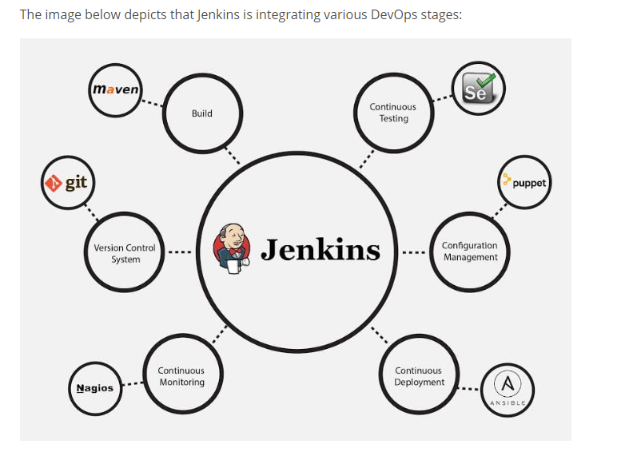
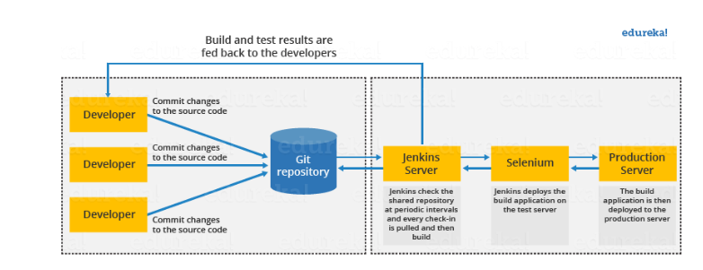
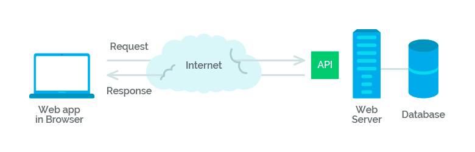

# Continuous integration with Jenkins

## What Is Jenkins
Put simply, Jenkins is an open source automation server
Jenkins is used to build and test software projects continuously, this makes it easier for developers to integrate code
as changes are made through small incremental steps
If any errors are found when Jenkins tries to build our project, the build will fail and the developer would be
altered immediately
If the build is successful, the project can be placed in the Delivery Phase

As default Jenkins comes with limited features however it has over 1000 plugins, version controls such as git as well
as integration tools like Maven must be installed to use

### Beneftis
- Easy to detect bugs as tests are run after each commit
- Automated testing and building means more time can be spent on improving the software quality
- Automated processes also mean companies can be more reactive to customer feedback, increase customer satisfaction

## Continuous Integration with Jenkins

- Developer commits to the shared repository
- Jenkins detects the changes and pulls the code to prepare a build
- If the build fails, the developer would be notified
- If the build is successful, Jenkins will deploy the test server
- Providing the tests pass, the application can be moved to the deployment stage, if not the developer is sent feedback
- Jenkins server continues to check the shared repo for changes

## Creating A Jenkis webhook on Github

1. We must first direct to the settings area of our chosen repository and then click on webhook and add webhook
2. Once here we must paste the URL of the Jenkins environment we are working on

## Configuring on Jenkins

1. Create a branch named 'develop' 
2.

## What is a webhook

A webhook is a way for an application to provide other application with real-time information, delivering data to other
apps as it happens
Also referred to as reverse APIs, with most API's there's a request followed by a response however no requests are
required with webhooks and instead the data is just sent when available

An API would be calling someone every 5 minutes to ask them something, however a webhook would be more like waiting until
the person calls you, as you can see no request was required here

## What is an API

API stands for Application Programming Interface,they allow apps to communicate with each other

## What is an API Call
- This is where a call is made to a server using an API, information is sent out and then processed back to you

